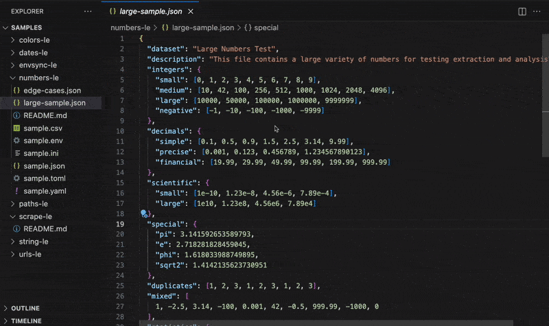
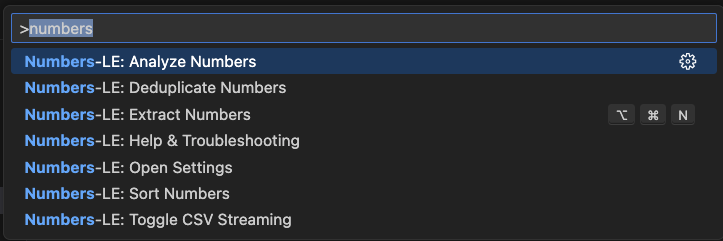

  

<h1 align="center">Numbers-LE: Zero Hassle Number Extraction</h1>

  <b>Instantly extract every numeric value in precise order</b> 
  <i>JSON, YAML, CSV, TOML, INI, ENV</i>

  <!-- VS Code Marketplace -->
  
  <!-- Open VSX -->
  
  <!-- Build -->
  
  <!-- License -->
  

  <i>Tested on <b>Ubuntu</b>, <b>macOS</b>, and <b>Windows</b> for maximum compatibility.</i>

---

  

  

## 🙏 Thank You

If Numbers-LE saves you time, a quick rating helps other developers discover it:  
⭐ [VS Code Marketplace](https://marketplace.visualstudio.com/items?itemName=OffensiveEdge.numbers-le) • [Open VSX](https://open-vsx.org/extension/OffensiveEdge/numbers-le)

## ✅ Why Numbers-LE?

Extract numbers from **any file format** — JSON, CSV, YAML, ENV, TOML, INI — in one click. No regex. No scripts. Just results.

Numbers-LE intelligently identifies **true numeric values** (integers, floats, percentages, currencies) while filtering out IDs, version numbers, and non-data noise. Get clean, ordered data ready for analysis.

- **Data analysis without the hassle**  
  Instantly extract and analyze numeric data from any structured file. Get statistical insights, trends, and patterns in seconds.

- **Validation across configs & APIs**  
  Surface every numeric value for validation, range checking, and data integrity verification.

- **Confident edits in complex datasets**  
  Flatten nested numbers into a simple list you can safely analyze without breaking structure or formatting.

- **Stream massive datasets**  
  Work with millions of rows without locking up VS Code. Select only the columns you need and stream results directly to the editor.

- **Statistical analysis built-in**
  - **Basic stats** - count, sum, average, min, max, median, mode
  - **Advanced analysis** - range, variance, standard deviation
  - **Data insights** - outliers, trends, patterns
- **Automatic cleanup built-in**
  - **Sort** for stable analysis and reviews
  - **Dedupe** to eliminate noise
  - **Filter** by ranges or conditions
- **Fast at any scale**  
  Benchmarked for millions of numbers per second, Numbers-LE keeps up with large datasets and enterprise monorepos without slowing you down.

## 🚀 More from the LE Family

- **[String-LE](https://marketplace.visualstudio.com/items?itemName=OffensiveEdge.string-le)** - Extract user-visible strings for i18n and validation • [Open VSX](https://open-vsx.org/extension/OffensiveEdge/string-le)
- **[EnvSync-LE](https://marketplace.visualstudio.com/items?itemName=OffensiveEdge.envsync-le)** - Keep .env files in sync with visual diffs • [Open VSX](https://open-vsx.org/extension/OffensiveEdge/envsync-le)
- **[Paths-LE](https://marketplace.visualstudio.com/items?itemName=OffensiveEdge.paths-le)** - Extract file paths from imports and dependencies • [Open VSX](https://open-vsx.org/extension/OffensiveEdge/paths-le)
- **[URLs-LE](https://marketplace.visualstudio.com/items?itemName=OffensiveEdge.urls-le)** - Audit API endpoints and external resources • [Open VSX](https://open-vsx.org/extension/OffensiveEdge/urls-le)
- **[Scrape-LE](https://marketplace.visualstudio.com/items?itemName=OffensiveEdge.scrape-le)** - Validate scraper targets before debugging • [Open VSX](https://open-vsx.org/extension/OffensiveEdge/scrape-le)
- **[Colors-LE](https://marketplace.visualstudio.com/items?itemName=OffensiveEdge.colors-le)** - Extract and analyze colors from stylesheets • [Open VSX](https://open-vsx.org/extension/OffensiveEdge/colors-le)
- **[Dates-LE](https://marketplace.visualstudio.com/items?itemName=OffensiveEdge.dates-le)** - Extract temporal data from logs and APIs • [Open VSX](https://open-vsx.org/extension/OffensiveEdge/dates-le)

## 💡 Use Cases

- **Financial Analysis** - Extract revenue, profit, and growth metrics from JSON/CSV for quick validation
- **Config Validation** - Pull timeouts, limits, and thresholds from YAML/TOML/INI for auditing
- **Performance Monitoring** - Analyze CPU, memory, and response times from logs and metrics files
- **Data QA** - Get instant statistics (avg, median, outliers) on numeric datasets

## 🚀 Quick Start

1. Install from [VS Code Marketplace](https://marketplace.visualstudio.com/items?itemName=OffensiveEdge.numbers-le) or [Open VSX](https://open-vsx.org/extension/OffensiveEdge/numbers-le)
2. Open any supported file type (`Cmd/Ctrl + P` → search for "Numbers-LE")
3. Run Quick Extract (`Cmd+Alt+N` / `Ctrl+Alt+N` / Status Bar)

## ⚙️ Configuration

- `numbers-le.openResultsSideBySide` – Open to the side
- `numbers-le.csv.streamingEnabled` – Toggle CSV streaming
- `numbers-le.dedupeEnabled` – Auto-dedupe numbers
- `numbers-le.sortEnabled` – Auto-sort output
- `numbers-le.analysis.enabled` – Enable statistical analysis
- `numbers-le.analysis.includeStats` – Include detailed statistics
- **Safety Guards** – File size warnings & thresholds
- **Notification Levels** – Control verbosity and alerts

## ⚡ Performance

<!-- PERFORMANCE_START -->

Numbers-LE is built for speed and handles files from 100KB to 30MB+. See [detailed benchmarks](docs/PERFORMANCE.md).

| Format   | File Size | Throughput | Duration | Memory | Tested On     |
| -------- | --------- | ---------- | -------- | ------ | ------------- |
| **JSON** | 0.13MB    | 1218182    | ~1.1     | < 1MB  | Apple Silicon |
| **JSON** | 1.31MB    | 1593824    | ~8.42    | < 1MB  | Apple Silicon |
| **JSON** | 6.55MB    | 1356652    | ~49.46   | < 1MB  | Apple Silicon |
| **CSV**  | 0.5MB     | 1232136    | ~15.87   | < 1MB  | Apple Silicon |
| **CSV**  | 3MB       | 1548819    | ~75.77   | ~13MB  | Apple Silicon |
| **CSV**  | 10MB      | 1204916    | ~324.64  | < 1MB  | Apple Silicon |
| **ENV**  | 5K lines  | 1,561,687  | ~19.21   | < 1MB  | Apple Silicon |

**Real-World Performance**: Tested with actual data up to 30MB (practical limit: 1MB warning, 10MB error threshold)  
**Performance Monitoring**: Built-in real-time tracking with configurable thresholds  
**Full Metrics**: [docs/PERFORMANCE.md](docs/PERFORMANCE.md) • Test Environment: macOS, Bun 1.2.22, Node 22.x

<!-- PERFORMANCE_END -->

## 🧩 System Requirements

**VS Code** 1.70.0+ • **Platform** Windows, macOS, Linux  
**Memory** 500MB recommended for large files

## 🔒 Privacy

100% local processing. No data leaves your machine. Optional logging: `numbers-le.telemetryEnabled`

## 🌍 Language Support

**13 languages**: English, German, Spanish, French, Indonesian, Italian, Japanese, Korean, Portuguese (Brazil), Russian, Ukrainian, Vietnamese, Chinese (Simplified)

## 🔧 Troubleshooting

**Not detecting numbers?**  
Ensure file is saved with supported extension (.json, .yaml, .csv, .toml, .ini, .env)

**Large files slow?**  
Enable CSV streaming: `numbers-le.csv.streamingEnabled: true`

**Need help?**  
Check [Issues](https://github.com/OffensiveEdge/numbers-le/issues) or enable logging: `numbers-le.telemetryEnabled: true`

## ❓ FAQ

**What numbers are extracted?**  
Integers, floats, percentages, currencies (excludes IDs, version numbers)

**Can I get statistics?**  
Yes, enable `numbers-le.analysis.enabled: true` for avg, median, std dev, outliers

**Max file size?**  
Up to 500MB with CSV streaming. Practical limit: 10MB for other formats

**CSV streaming?**  
Enable `numbers-le.csv.streamingEnabled: true` to process large CSVs in chunks

## 📊 Testing

**129 unit tests** • **47.22% function coverage, 9.19% line coverage**  
Powered by Vitest • Run with `bun test --coverage`

---

Copyright © 2025  
<a href="https://github.com/OffensiveEdge">@OffensiveEdge</a>. All rights reserved.
