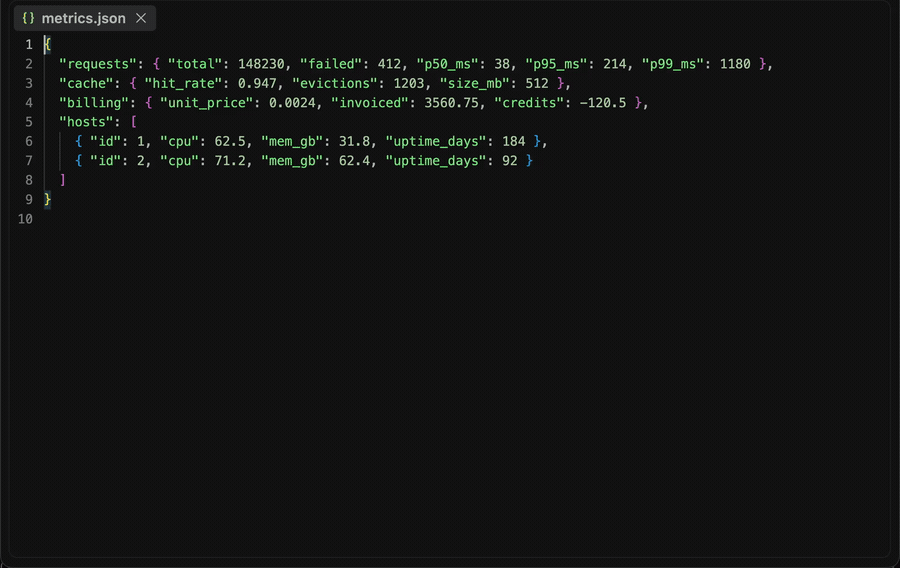

<p align="center">
  
</p>
<h1 align="center">Numbers-LE: Zero Hassle Number Extraction</h1>
<p align="center">
  <b>Pull every number out of the current file in one keystroke</b><br/>
  <i>JSON, YAML, CSV, TOML, INI, and Environment files</i>
</p>

<p align="center">
  <a href="https://marketplace.visualstudio.com/items?itemName=nolindnaidoo.numbers-le">
    
  </a>
  <a href="https://letools.dev">
    
  </a>
</p>

---

<p align="center">
  
</p>

> **Useful?** A star or rating is how other developers find it —
> [★ GitHub](https://github.com/nolindnaidoo/numbers-le) ·
> [★ Marketplace](https://marketplace.visualstudio.com/items?itemName=nolindnaidoo.numbers-le&ssr=false#review-details) ·
> [★ Open VSX](https://open-vsx.org/extension/OffensiveEdge/numbers-le/reviews)

## What it does

Open a file, press `Ctrl+Alt+N` (`Cmd+Alt+N` on Mac), and every numeric value in the document lands in a new editor — deduplicate and sort it from there. Works in VS Code and in VS Code–based editors like Cursor and VSCodium (installable from Open VSX).

- **Data validation** — pull the numbers out of a config or fixture and eyeball ranges at a glance
- **Config audits** — compare ports, thresholds, and limits across INI/TOML/.env files
- **CSV work** — extract everything, one column, or several columns into separate documents

## Supported formats

| Format | What counts as a number |
|---|---|
| JSON | Number values anywhere in the structure. Quoted numbers (`"42"`) are strings, not numbers, and are never extracted |
| YAML | Number values, including hex/octal int forms and exponents; multi-document (`---`) streams extract from every document |
| TOML | Integer and float values (dates are not numbers) |
| CSV | Cells whose entire content is numeric — `19.99` counts, `12abc` and `1,000` do not. No header inference: every row is data |
| INI | Values whose entire content is numeric (INI values are inherently strings) |
| Environment | Values whose entire content is numeric (`PORT=3000` yields 3000; `VERSION=1.2.3` yields nothing) |

The shared policy (one heuristics module, applied to every format): only finite numbers are extracted — `NaN` and `inf`/`.inf` never appear in results — and a coerced string must be numeric in full: plain decimals with optional sign, decimal point, and exponent. For unrecognized file types you can pick a format explicitly or fall back to a plain-text scan (no grammar: `v1.2.3` reads as `1.2` and `0.3`).

## Commands

| Command | Description |
|---|---|
| `Numbers-LE: Extract Numbers` (`Ctrl+Alt+N` / `Cmd+Alt+N`) | Extract all numbers from the active document |
| `Numbers-LE: Deduplicate Numbers` | Remove duplicate numbers from the results |
| `Numbers-LE: Sort Numbers` | Sort results numerically or by magnitude |
| `Numbers-LE: Toggle CSV Streaming` | Flip `csv.streamingEnabled` for large CSV files |
| `Numbers-LE: Open Settings` | Open Numbers-LE settings |
| `Numbers-LE: Help & Troubleshooting` | Built-in documentation |

## Settings

| Setting | Default | Description |
|---|---|---|
| `numbers-le.openResultsSideBySide` | `true` | Open results beside the current editor |
| `numbers-le.postProcess.openInNewFile` | `true` | Dedupe/Sort write to a new file instead of replacing the editor content |
| `numbers-le.copyToClipboardEnabled` | `false` | Also copy results to the clipboard (non-CSV) |
| `numbers-le.dedupeEnabled` | `false` | Deduplicate automatically during extraction |
| `numbers-le.sortEnabled` | `false` | Sort automatically during extraction |
| `numbers-le.sortMode` | `off` | `numeric-asc/desc`, `magnitude-asc/desc` |
| `numbers-le.csv.streamingEnabled` | `false` | Incremental CSV parsing for large files |
| `numbers-le.showParseErrors` | `false` | Surface parse errors as notifications |
| `numbers-le.notificationsLevel` | `silent` | `all` = every notification, `important` = warnings + errors, `silent` = errors only |
| `numbers-le.safety.enabled` | `true` | Guardrails for very large files/outputs |
| `numbers-le.safety.fileSizeWarnBytes` | `1000000` | Warn above this file size |
| `numbers-le.safety.largeOutputLinesThreshold` | `50000` | Offer Open/Copy/Cancel above this result count |
| `numbers-le.safety.manyDocumentsThreshold` | `8` | Confirm before opening this many column documents |
| `numbers-le.statusBar.enabled` | `true` | Show the status bar item |
| `numbers-le.telemetryEnabled` | `false` | Local-only event log (see Privacy) |

The settings UI is translated into 12 languages besides English.

## Privacy & security

- **No network access.** The extension never sends data anywhere. The `telemetryEnabled` setting only writes events to a local Output Channel you can inspect (`Numbers-LE`).
- Error notifications redact home directories and credential-shaped fragments.

## Development

```bash
bun install
bun run build            # esbuild bundle -> dist/extension.js
bun run typecheck        # tsc --noEmit (includes tests)
bun run test             # vitest unit suite
bun run test:integration # real VS Code extension host
bun run lint             # biome
bun run package          # VSIX into release/
```

Architecture and conventions live in [AGENTS.md](AGENTS.md). Changes are tracked in [CHANGELOG.md](CHANGELOG.md).

## Performance

<!-- performance:start -->
| Input | Size | Found | Time | Rate | Scan speed |
| --- | --- | --- | --- | --- | --- |
| JSON metrics | 2.18 MB | 120,000 | 22.32 ms | 5,376,475/sec | 97.9 MB/s |
| CSV data | 0.93 MB | 150,000 | 51.26 ms | 2,926,066/sec | 18.2 MB/s |
| INI config | 0.42 MB | 30,000 | 20.05 ms | 1,496,430/sec | 20.7 MB/s |

Median of 7 runs after warmup, on Apple M5 Pro, 24 GB RAM, Node 24.3.0. Inputs are generated
by `scripts/benchmark.ts` rather than checked in, so the sizes above are
exactly what was measured. Reproduce with `bun run benchmark`.

These are machine-specific and are not asserted in CI — a benchmark that gates
a build only tells you how busy the runner was.
<!-- performance:end -->

## Testing

<!-- coverage:start -->
| Metric | Coverage |
| --- | --- |
| Statements | 78.13% |
| Branches | 62.57% |
| Functions | 90.26% |
| Lines | 79.61% |

221 test cases across 17 files, plus an integration suite that runs
in a real VS Code extension host and an end-to-end test that installs the
built `.vsix` into a clean profile.

Generated from `coverage/coverage-summary.json` by
`scripts/coverage-readme.js`; CI fails if this section drifts from a fresh
run. Reproduce with `bun run test:coverage`.
<!-- coverage:end -->

## More from the LE Family

Every tool in the family, one page: **[letools.dev](https://letools.dev)**

- **[String-LE](https://marketplace.visualstudio.com/items?itemName=nolindnaidoo.string-le)** - Extract string values for i18n from JSON, YAML, CSV, TOML, INI, and .env
- **[Paths-LE](https://marketplace.visualstudio.com/items?itemName=nolindnaidoo.paths-le)** - Extract file paths from JS/TS imports, JSON, HTML, CSS, TOML, CSV, and .env
- **[EnvSync-LE](https://marketplace.visualstudio.com/items?itemName=nolindnaidoo.envsync-le)** - Spot missing keys across your .env files, with a markdown report
- **[Regex-LE](https://marketplace.visualstudio.com/items?itemName=nolindnaidoo.regex-le)** - Find, test, and validate regular expressions with ReDoS screening
- **[Secrets-LE](https://marketplace.visualstudio.com/items?itemName=nolindnaidoo.secrets-le)** - Detect and sanitize credentials locally, before you commit
- **[Scrape-LE](https://marketplace.visualstudio.com/items?itemName=nolindnaidoo.scrape-le)** - Check whether a page is scrapeable before you write the scraper
- **[Colors-LE](https://marketplace.visualstudio.com/items?itemName=nolindnaidoo.colors-le)** - Extract and analyze colors from CSS, SCSS, LESS, Stylus, HTML, JS/TS, and SVG
- **[URLs-LE](https://marketplace.visualstudio.com/items?itemName=nolindnaidoo.urls-le)** - Extract URLs from documentation, configs, and code
- **[Dates-LE](https://marketplace.visualstudio.com/items?itemName=nolindnaidoo.dates-le)** - Extract and analyze dates from logs, configs, and code

## Also by nolindnaidoo

**Rust**

- **[pixelcoords](https://github.com/nolindnaidoo/pixelcoords)** - Mark pixel-exact coordinates machines can use · [pixelcoords.dev](https://pixelcoords.dev)
- **[pixelactions](https://github.com/nolindnaidoo/pixelactions)** - Perform the interaction and confirm it landed · [pixelactions.dev](https://pixelactions.dev)

**Contact Developer** — [GitHub](https://github.com/nolindnaidoo) · [LinkedIn](https://www.linkedin.com/in/nolindnaidoo/)

## License

MIT © [nolindnaidoo](https://github.com/nolindnaidoo)
