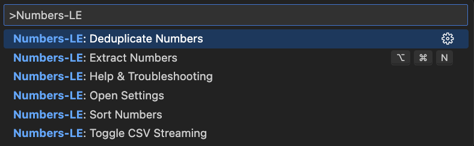

<p align="center">
  
</p>
<h1 align="center">Numbers-LE: Zero Hassle Number Extraction</h1>
<p align="center">
  <b>Instantly extract every numeric value in precise order</b><br/>
  <i>JSON, YAML, CSV, TOML, INI, ENV</i>
</p>

<p align="center">
  <!-- VS Code Marketplace -->
  <a href="https://marketplace.visualstudio.com/items?itemName=nolindnaidoo.numbers-le">
    
  </a>
  <!-- Open VSX -->
  <a href="https://open-vsx.org/extension/nolindnaidoo/numbers-le">
    
  </a>
  <!-- Build -->
  <a href="https://github.com/nolindnaidoo/numbers-le/actions">
    
  </a>
  <!-- License -->
  <a href="https://github.com/nolindnaidoo/numbers-le/blob/main/LICENSE">
    
  </a>
</p>

<p align="center">
  <i>Tested on <b>Ubuntu</b>, <b>macOS</b>, and <b>Windows</b> for maximum compatibility.</i>
</p>

---

<p align="center">
  
</p>

<p align="center">
  
</p>

## 🙏 Thank You!

Thank you for your interest in Numbers-LE! If this extension has been helpful in managing your number extraction needs, please consider leaving a rating on [VS Code Marketplace](https://marketplace.visualstudio.com/items?itemName=nolindnaidoo.numbers-le) and [Open VSX](https://open-vsx.org/extension/nolindnaidoo/numbers-le). Your feedback helps other developers discover this tool and motivates continued development.

⭐ **Star this repository** to get notified about updates and new features!

## ✅ Why Numbers-LE

**Modern projects contain numeric data everywhere** — APIs, configs, CSVs, and data files across both native and web. Extracting and analyzing those numbers is still a slow, manual process.

**Numbers-LE makes number extraction effortless.**  
It smartly pulls out only the **true numeric values** (integers, floats, percentages, currencies) and gives you clean, ordered data ready for analysis.

- **Data analysis without the hassle**  
  Instantly extract and analyze numeric data from any structured file. Get statistical insights, trends, and patterns in seconds.

- **Validation across configs & APIs**  
  Surface every numeric value for validation, range checking, and data integrity verification.

- **Confident edits in complex datasets**  
  Flatten nested numbers into a simple list you can safely analyze without breaking structure or formatting.

- **Stream massive datasets**  
  Work with millions of rows without locking up VS Code. Select only the columns you need and stream results directly to the editor.

- **Statistical analysis built-in**
  - **Basic stats** - count, sum, average, min, max, median, mode
  - **Advanced analysis** - range, variance, standard deviation
  - **Data insights** - outliers, trends, patterns
- **Automatic cleanup built-in**
  - **Sort** for stable analysis and reviews
  - **Dedupe** to eliminate noise
  - **Filter** by ranges or conditions
- **Fast at any scale**  
  Benchmarked for millions of numbers per second, Numbers-LE keeps up with large datasets and enterprise monorepos without slowing you down.

## 🚀 More from the LE Family

**Numbers-LE** is part of a growing family of developer tools designed to make your workflow effortless:

- **Strings-LE** - Extract every user-visible string from JSON, YAML, CSV, TOML, INI, and .env files with zero hassle  
  [[VS Code Marketplace](https://marketplace.visualstudio.com/items?itemName=nolindnaidoo.string-le)] [[Open VSX](https://open-vsx.org/extension/nolindnaidoo/string-le)]

- **EnvSync-LE** - Effortlessly detect, compare, and synchronize .env files across your workspace with visual diffs  
  [[VS Code Marketplace](https://marketplace.visualstudio.com/items?itemName=nolindnaidoo.envsync-le)] [[Open VSX](https://open-vsx.org/extension/nolindnaidoo/envsync-le)]

- **Colors-LE** - Extract and analyze colors from CSS, HTML, JavaScript, and more  
  [[VS Code Marketplace](https://marketplace.visualstudio.com/items?itemName=nolindnaidoo.colors-le)] [[Open VSX](https://open-vsx.org/extension/nolindnaidoo/colors-le)]

- **Dates-LE** - Extract and analyze dates from logs, APIs, and temporal data  
  [[VS Code Marketplace](https://marketplace.visualstudio.com/items?itemName=nolindnaidoo.dates-le)] [[Open VSX](https://open-vsx.org/extension/nolindnaidoo/dates-le)]

- **Paths-LE** - Extract and analyze file paths from imports, configs, and dependencies  
  [[VS Code Marketplace](https://marketplace.visualstudio.com/items?itemName=nolindnaidoo.paths-le)] [[Open VSX](https://open-vsx.org/extension/nolindnaidoo/paths-le)]

- **URLs-LE** - Extract and analyze URLs from web content, APIs, and resources  
  [[VS Code Marketplace](https://marketplace.visualstudio.com/items?itemName=nolindnaidoo.urls-le)] [[Open VSX](https://open-vsx.org/extension/nolindnaidoo/urls-le)]

Each tool follows the same philosophy: **Zero Hassle, Maximum Productivity**.

## 💡 Use Cases & Examples

### Financial Data Analysis

Extract and analyze financial metrics from API responses:

```json
// Extract from financial-data.json
{
  "revenue": 1250000.5,
  "profit": 250000.75,
  "margin": 20.0,
  "growth_rate": 15.5
}
```

### Configuration Validation

Validate numeric settings across configuration files:

```yaml
# Extract from config.yaml
database:
  max_connections: 100
  timeout: 30
  retry_attempts: 3

cache:
  ttl: 3600
  max_size: 1000
```

### Performance Metrics Analysis

Extract performance data from monitoring systems:

```csv
// Extract from metrics.csv
timestamp,cpu_usage,memory_usage,response_time
2023-12-25T10:00:00Z,45.2,78.5,120.3
2023-12-25T10:01:00Z,52.1,82.3,135.7
```

### Statistical Analysis

Perform statistical analysis on extracted numbers to identify trends, outliers, and patterns in your data.

## 🚀 Quick Start

1. Install from [VS Code Marketplace](https://marketplace.visualstudio.com/items?itemName=nolindnaidoo.numbers-le) or [Open VSX](https://open-vsx.org/extension/nolindnaidoo/numbers-le)
2. Open any supported file type (`Cmd/Ctrl + P` → search for "Numbers-LE")
3. Run Quick Extract (`Cmd+Alt+N` / `Ctrl+Alt+N` / Status Bar)

## ⚙️ Configuration

- `numbers-le.openResultsSideBySide` – Open to the side
- `numbers-le.csv.streamingEnabled` – Toggle CSV streaming
- `numbers-le.dedupeEnabled` – Auto-dedupe numbers
- `numbers-le.sortEnabled` – Auto-sort output
- `numbers-le.analysis.enabled` – Enable statistical analysis
- `numbers-le.analysis.includeStats` – Include detailed statistics
- **Safety Guards** – File size warnings & thresholds
- **Notification Levels** – Control verbosity and alerts

## ⚡ Performance

Numbers-LE is built for speed across all supported formats:

| Format   | Throughput        | Best For               | File Size Range | Hardware Tested  |
| -------- | ----------------- | ---------------------- | --------------- | ---------------- |
| **ENV**  | 4M+ numbers/sec   | Environment configs    | 1KB - 5MB       | M1 Mac, Intel i7 |
| **JSON** | 1.8M+ numbers/sec | APIs, large datasets   | 1KB - 200MB     | M1 Mac, Intel i7 |
| **INI**  | 1.3M+ numbers/sec | Configuration files    | 1KB - 10MB      | M1 Mac, Intel i7 |
| **TOML** | 530K+ numbers/sec | Modern configs         | 1KB - 25MB      | M1 Mac, Intel i7 |
| **CSV**  | 440K+ numbers/sec | Tabular data           | 1KB - 500MB     | M1 Mac, Intel i7 |
| **YAML** | 190K+ numbers/sec | Human-readable configs | 1KB - 50MB      | M1 Mac, Intel i7 |

### Performance Notes

- **Memory Usage**: ~100MB base + 3MB per 1000 numbers processed
- **Large Files**: Files over 100MB may show reduced throughput (100K-500K numbers/sec)
- **CSV Streaming**: Enables processing of files up to 500MB without memory issues
- **Statistical Analysis**: Adds 30-50% processing time when enabled
- **Hardware Requirements**: Minimum 4GB RAM, recommended 8GB+ for large datasets

## 🧩 System Requirements

- **VS Code**: 1.70.0 or higher
- **Node.js**: Not required (extension runs in VS Code's built-in runtime)
- **Platform**: Windows, macOS, Linux
- **Memory**: 100MB minimum, 500MB recommended for large datasets
- **Storage**: 20MB for extension files

## 🔒 Privacy & Telemetry

- Runs entirely locally; no data is sent off your machine.
- Optional local-only logs can be enabled with `numbers-le.telemetryEnabled`.
- Logs appear in Output panel → "Numbers-LE".

## 🌍 Language Support

- **English** - Full support
- **Additional languages** - May be added in future releases based on user feedback

Interested in helping translate Numbers-LE? [Open an issue](https://github.com/nolindnaidoo/numbers-le/issues) to contribute!

## 🔧 Troubleshooting

### Common Issues

**Extension not detecting numbers**

- Ensure file is saved and has a supported extension (.json, .yaml, .csv, .toml, .ini, .env)
- Check that `numbers-le.analysis.enabled` is set to `true` in settings
- Try reloading VS Code window (`Ctrl/Cmd + Shift + P` → "Developer: Reload Window")

**Performance issues with large files**

- Files over 50MB may take longer to process
- Enable `numbers-le.csv.streamingEnabled: true` for CSV files
- Consider using `numbers-le.dedupeEnabled: false` to reduce processing time
- Disable `numbers-le.analysis.includeStats: false` for faster extraction

**Numbers not appearing in results**

- Verify the number format is supported (integers, floats, percentages, currencies)
- Check if numbers are inside strings or comments
- Ensure numbers are not part of identifiers or variable names
- Check for proper number formatting (e.g., "1,000" vs "1000")

**CSV streaming issues**

- Ensure CSV has proper headers for column selection
- Check that `numbers-le.csv.streamingEnabled` is enabled
- Verify CSV delimiter is standard (comma, semicolon, tab)
- Large CSV files may require streaming to avoid memory issues

**Statistical analysis problems**

- Enable `numbers-le.analysis.enabled: true` for statistical insights
- Check that `numbers-le.analysis.includeStats: true` is set
- Some statistical calculations may fail with insufficient data
- Outlier detection requires minimum data points

**Extension crashes or freezes**

- Check VS Code version compatibility (requires 1.70.0+)
- Disable other number-related extensions temporarily
- Check Output panel → "Numbers-LE" for error messages
- Consider reducing file size or using streaming mode

### Getting Help

- Check the [Issues](https://github.com/nolindnaidoo/numbers-le/issues) page for known problems
- Enable telemetry logging: `numbers-le.telemetryEnabled: true`
- Review logs in Output panel → "Numbers-LE"

## ❓ FAQ

**Q: What types of numbers are extracted?**
A: Numbers-LE extracts integers, floats, percentages, currencies, and other numeric values while excluding numbers that are part of identifiers or variable names.

**Q: Can I get statistical analysis of the numbers?**
A: Yes, enable `numbers-le.analysis.enabled: true` to get basic stats (count, sum, average, min, max) and advanced analysis (variance, standard deviation, outliers).

**Q: How does CSV streaming work?**
A: When `numbers-le.csv.streamingEnabled: true` is enabled, large CSV files are processed in chunks to avoid memory issues. You can select specific columns for extraction.

**Q: Can I automatically deduplicate numbers?**
A: Yes, enable `numbers-le.dedupeEnabled: true` to automatically remove duplicate numbers from the results.

**Q: How does sorting work?**
A: Enable `numbers-le.sortEnabled: true` to automatically sort numbers in ascending order. This helps with analysis and review processes.

**Q: What's the largest file size supported?**
A: Numbers-LE can handle files up to 500MB with CSV streaming enabled. For other formats, the limit is around 200MB for optimal performance.

## 📊 Test Coverage

- 182 passing tests across 14 test suites with 36.58% overall coverage
- Core extraction and analysis modules have excellent coverage
- Contract tests for configuration side-effects and parse-error handling
- Data-driven fixtures with golden expected outputs per format
- Tests powered by Vitest with V8 coverage
- Runs quickly and locally: `bun run test` or `bun run test:coverage`
- Coverage reports output to `coverage/` (HTML summary at `coverage/index.html`)

---

Copyright © 2025  
<a href="https://github.com/nolindnaidoo">@nolindnaidoo</a>. All rights reserved.
