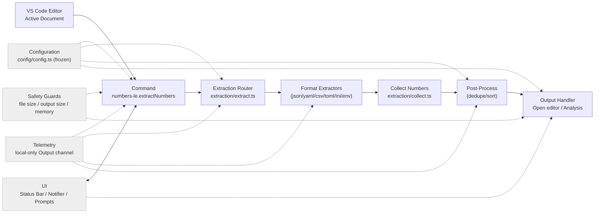
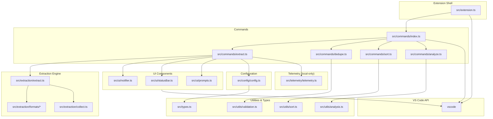
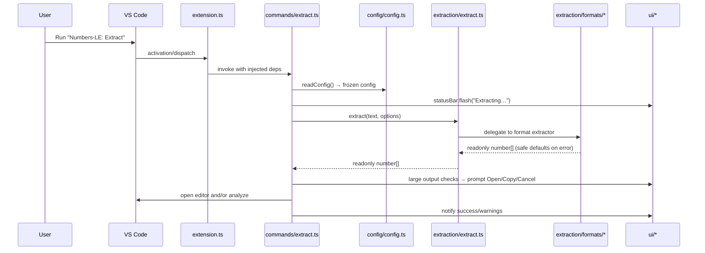
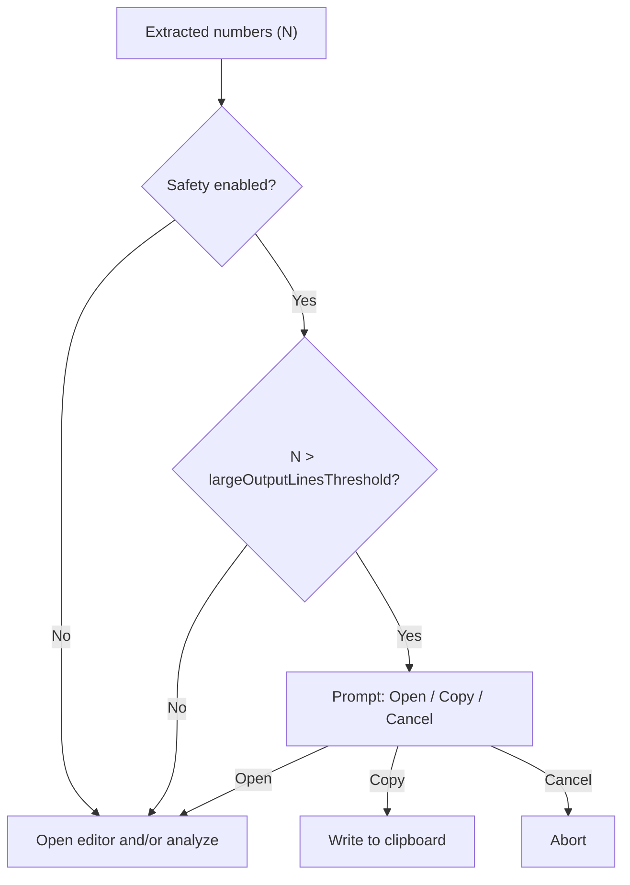
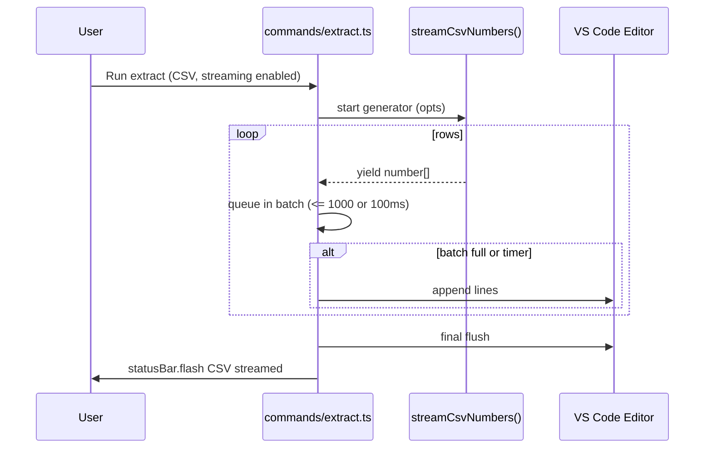

# Numbers-LE Architecture

Technical architecture, design patterns, and module boundaries for production-grade number extraction at scale.

## Core Structure

```
src/
├── extension.ts          # Minimal activation - registers commands/providers only
├── types.ts             # Core type definitions and interfaces
├── commands/            # Command implementations with dependency injection
│   ├── index.ts         # Centralized command registration
│   ├── extract.ts       # Main extraction command
│   ├── dedupe.ts        # Deduplication post-processing
│   ├── sort.ts          # Sorting post-processing
│   └── analyze.ts       # Statistical analysis command
├── extraction/          # Number extraction engine
│   ├── extract.ts       # Router pattern - delegates to format handlers
│   ├── collect.ts       # Recursive object traversal utilities
│   ├── formats/         # Format-specific extractors
│   │   ├── json.ts      # JSON parser with error handling
│   │   ├── yaml.ts      # YAML parser
│   │   ├── csv.ts       # CSV parser with streaming support
│   │   ├── toml.ts      # TOML parser
│   │   ├── ini.ts       # INI file parser
│   │   └── env.ts       # Environment file parser
│   └── __data__/        # Test fixtures with expected outputs
├── config/              # Configuration management
│   ├── config.ts        # Main config reader with frozen objects
│   └── settings.ts      # VS Code settings command registration
├── ui/                  # User interface components
│   ├── statusBar.ts     # Status bar factory with flash messaging
│   ├── notifier.ts      # Notification abstraction
│   └── prompts.ts       # User input prompts
├── utils/               # Pure utility functions
│   ├── analysis.ts      # Statistical analysis (mean, median, std dev)
│   ├── sort.ts          # Number sorting utilities
│   └── validation.ts    # Input validation
└── telemetry/           # Local-only logging
    └── telemetry.ts     # Output channel factory
```

## Runtime Flow



Key properties:

- Configuration is read once per action and exposed as immutable objects
- Errors never throw from extractors; safe defaults are returned
- Safety prompts offer Open / Copy / Cancel for large outputs
- Statistical analysis is opt-in via configuration

## Module Boundaries and Dependencies



Conventions:

- All factory outputs are immutable; data structures use `readonly` and `Object.freeze()`
- Dependency injection is used for commands; `src/extension.ts` stays thin
- Modules prefer pure functions with explicit return types

---

## Architectural Principles

- **Minimal activation**: `src/extension.ts` wires dependencies and registers disposables only
- **Pure core**: extraction, utilities, and analysis are pure functions with explicit return types
- **Immutable data**: config and results are frozen; no in-place mutations
- **Safety first**: guard rails for file size, output size, and memory usage
- **Progressive disclosure**: subtle status bar feedback; prompts only when needed
- **Performance by design**: streaming support for large datasets, efficient algorithms

## Design Rationale

### Why Functional Over OOP

**Decision**: Use factory functions and pure functions rather than classes.

**Rationale**:

- Immutability guarantees via `Object.freeze()` prevent entire classes of bugs
- Pure functions are trivially testable without complex mock hierarchies
- No hidden state or side effects; all dependencies are explicit
- Smaller bundle size (no class overhead)
- Better tree-shaking in bundlers

**Trade-off**: Slightly more verbose dependency passing, but gains in testability and reliability far outweigh this cost.

### Router Pattern for Format Extraction

**Decision**: Single entry point (`extract.ts`) delegates to format-specific modules.

**Rationale**:

- Format-specific logic is isolated and independently testable
- Adding new formats requires no changes to existing extractors
- Error handling is centralized with consistent behavior
- Easy to disable or modify specific format support

**Trade-off**: Extra indirection layer, but the modularity and maintainability justify it.

### Streaming for CSV

**Decision**: Implement generator-based streaming for CSV files.

**Rationale**:

- CSV files in enterprise environments can exceed 500MB
- Streaming keeps memory usage constant regardless of file size
- Progressive feedback via status bar improves UX for large files
- Allows cancellation mid-stream without wasted work

**Trade-off**: Streaming implementation is more complex, but essential for production use cases.

## Component Responsibilities

- **`commands/*`**: Orchestrate user interactions, read config, call core functions, present results
- **`extraction/*`**: Parse input and return `readonly number[]` with safe defaults
- **`ui/*`**: Present status, notifications, prompts for user feedback
- **`config/config.ts`**: Read, validate, freeze, and expose settings
- **`utils/*`**: Side-effect free helpers (analysis, sorting, validation)
- **`telemetry/telemetry.ts`**: Local-only Output channel logging

### Public Interfaces

```ts
export type ExtractorOptions = Readonly<{
  onParseError?: (message: string) => void;
  includeFloats?: boolean;
  includeIntegers?: boolean;
}>;

export type Extractor = (
  text: string,
  options?: ExtractorOptions
) => readonly number[];

export type NumbersLeConfig = Readonly<{
  dedupeEnabled: boolean;
  sortEnabled: boolean;
  sortMode: "asc" | "desc";
  analysis: Readonly<{
    enabled: boolean;
    includeStats: boolean;
  }>;
  safety: Readonly<{
    enabled: boolean;
    fileSizeWarnBytes: number;
    largeOutputLinesThreshold: number;
  }>;
  csv: Readonly<{ streamingEnabled: boolean }>;
  telemetryEnabled: boolean;
}>;

export type AnalysisResult = Readonly<{
  count: number;
  sum: number;
  average: number;
  min: number;
  max: number;
  median: number;
  mode: readonly number[];
  range: number;
  variance: number;
  standardDeviation: number;
}>;
```

## Sequence: Extract Command



## Dependency Injection Contracts

```ts
export function registerAllCommands(
  context: vscode.ExtensionContext,
  deps: Readonly<{
    telemetry: Telemetry;
    notifier: Notifier;
    statusBar: StatusBar;
  }>
): void;
```

Guidelines:

- Construct UI and telemetry factories at activation; pass to command registrars
- Keep all state within function scope or minimal module closures; avoid globals

## Cross-Cutting Concerns

- **Localization**: Manifest strings in `package.nls*.json`; runtime via `vscode-nls`
- **Telemetry**: Local-only; off by default; outputs to Output panel
- **Safety**: Thresholds and prompts central to UX; never block without an option to proceed
- **Cancellation**: Use `withProgress` and cancellation tokens for long operations

## Extensibility Playbooks

- **Add extractor**: Implement `Extractor`, register in router, add tests and fixtures
- **Add command**: Create factory in `commands/`, declare in `package.json`, wire registration
- **Add setting**: Update `package.json` contributes, read/validate in config, consume in logic
- **Add analysis metric**: Extend `AnalysisResult`, implement in `utils/analysis.ts`, add tests

## Performance Budgets

- Small files (<100KB) end-to-end under ~100ms common path
- Large files (1-10MB) under 2 seconds with streaming
- Memory usage capped at 500MB with safety warnings
- Statistical analysis adds <30% processing time

## Security & Privacy

- No network calls; all processing is local
- Respect workspace trust and virtual workspace limitations
- Validate user inputs and file operations
- Sanitize prompts to prevent injection attacks

## Safety & UX Decision Flow



## CSV Streaming Pipeline



---

**Project:** [Issues](https://github.com/nolindnaidoo/numbers-le/issues) • [Pull Requests](https://github.com/nolindnaidoo/numbers-le/pulls) • [Releases](https://github.com/nolindnaidoo/numbers-le/releases)

**Docs:** [Architecture](ARCHITECTURE.md) • [Testing](TESTING.md) • [Performance](PERFORMANCE.md) • [Development](DEVELOPMENT.md) • [Troubleshooting](TROUBLESHOOTING.md) • [Privacy](PRIVACY.md)
